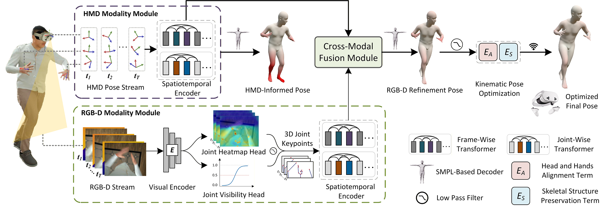

<div align= "center">
    <h1> Official Repo for EgoPoseVR (IEEE TVCG / IEEE VR 2026) </h1>

</div>

<div align="center">
    <h2> <a href="https://aplusx.github.io/EgoPoseVRWeb/">EgoPoseVR: Spatiotemporal Multi-Modal Reasoning for Egocentric Full-Body Pose in Virtual Reality</a></h2>

<p align="center">
  <a href="https://aplusx.github.io/EgoPoseVRWeb/">🌐 Project Page</a> •
  <a href="https://arxiv.org/abs/2602.05590">📄 Arxiv Paper</a> •
  <a href="https://huggingface.co/datasets/AplusX/EgoPoseVR">🤗 Dataset</a> •
  <a href="#-citation">📚 Citation</a>
</p>

</div>

<div align="center">

</div>


## 🏃 Intro

<p style="margin-bottom: 4px;">
We present EgoPoseVR, an end-to-end framework for accurate egocentric full-body pose estimation in VR that integrates headset motion cues with egocentric RGB-D observations through a dual-modality fusion pipeline. A spatiotemporal encoder extracts frame-and joint-level representations, which are fused via cross-attention to fully exploit complementary motion cues across modalities. A kinematic optimization module then imposes constraints from HMD signals, enhancing the accuracy and stability of pose estimation. To facilitate training and evaluation, we introduce a large-scale synthetic dataset of over 1.8 million temporally aligned HMD and RGB-D frames across diverse VR scenarios.
</p>



</details>

## 🚩 News

- [2026/04/12] 🔥🔥 Release **EgoPoseVR Dataset** on [🤗 Hugging Face](https://huggingface.co/datasets/AplusX/EgoPoseVR)
- [2026/04/11] Upload and init project

## 🤗 Dataset (~362 GB)

This dataset is designed for egocentric full-body motion analysis in virtual scenes. It contains paired RGB-D observations, pose annotations, HMD tracking signals, and SMPL body parameters. [Download here](https://huggingface.co/datasets/AplusX/EgoPoseVR).


<p align="center">
  <strong>🎬 Dataset Video</strong><br>
  
</p>

### Data Sources

The motion data is derived from the [AMASS](https://amass.is.tue.mpg.de/) dataset.  
In total, **2,344 motion sequences** are extracted. Each sequence folder corresponds to one continuous motion sequence, and each `.npz` file contains a 100-frame clip sampled from that sequence. 

### Data Contents

Each `.npz` file includes the following information:

| Field | Description | Shape |
|---|---|---|
| `input_rgbd` | Input RGB-D image sequence | `(T, 4, H, W)` |
| `gt_joints_relativeCam_2Dpos` | Ground-truth 2D joint positions projected onto the camera image plane | `(T, 22, 2)` |
| `gt_joints_relativePelvis_3Dpos` | Ground-truth 3D joint positions relative to the pelvis | `(T, 22, 3)` |
| `gt_pelvis_camera_3Dpos` | Ground-truth pelvis position in camera coordinates | `(T, 3)` |
| `gt_pelvis_camera_4Drot` | Ground-truth pelvis rotation in camera coordinates | `(T, 4)` |
| `hmd_position_global_full_gt_list` | Global HMD tracking signals | `(T, 54)` |
| `head_global_trans_list` | Global head transformation matrices | `(T, 4, 4)` |
| `body_parms_list` | SMPL body parameters (`root_orient`, `pose_body`, `trans`) | `dict` |
| `pred_2d` | Predicted 2D joint positions from the RGB-D module| `(T, 22, 2)` |
| `pred_3d` | Predicted 3D joint positions from the RGB-D module| `(T, 22, 3)` |

<!-- ### Dataset Split

| Split | Number of Clips |
|---|---:|
| Training | 14,702 |
| Validation | 1,827 |
| Test | 1,706 | -->

<!-- ### Directory Structure

```text
EgoPoseVR_Dataset/
├── Scene0/
├── Scene1/
├── Scene2/
├── Scene3/
├── Scene4/
├── Scene5/
├── Scene6/
│   └── AllDataPath_{Source}_{split}_{id}/
│       └── {clip_id}.npz
├── train_npz_paths.txt
├── val_npz_paths.txt
├── test_npz_paths.txt
└── all_npz_paths.txt
``` -->

## 📖 Citation

If you find our code or paper helps, please consider citing:

```bibtex
@article{cheng2026egoposevr,
  title={EgoPoseVR: Spatiotemporal Multi-Modal Reasoning for Egocentric Full-Body Pose in Virtual Reality},
  author={Cheng, Haojie and Ong, Shaun Jing Heng and Cai, Shaoyu and Koh, Aiden Tat Yang and Ouyang, Fuxi and Khoo, Eng Tat},
  journal={arXiv preprint arXiv:2602.05590},
  year={2026}
}
```
